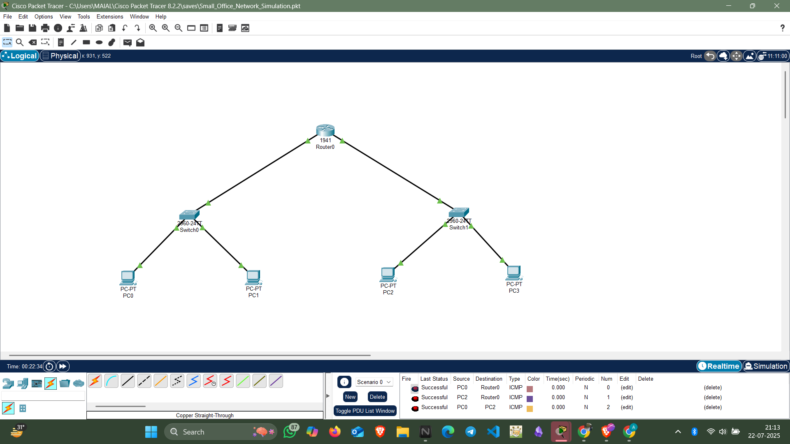
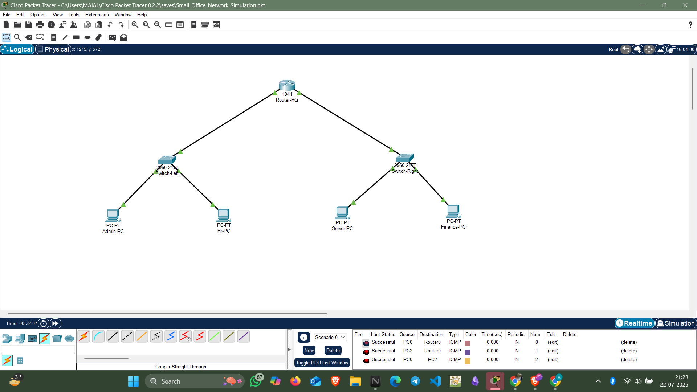

#  Small Office Network Simulation - Cisco Packet Tracer

This project is a simulation of a small office network using **Cisco Packet Tracer**. All devices are manually configured with **static IP addresses** to enable reliable internal communication.

## Network Overview
- **Router:** Cisco 1941
- **Switches:** Cisco 2960 Series
- **Devices:** PCs for Admin, HR, Finance, and Server

##  Features
- Static IP Addressing  
- LAN Communication  
- Layer 2 Switching  
- Basic Router Configuration  
- Connectivity Test via ICMP (Ping)

## Skills Demonstrated
- Network Topology Design  
- Cisco Device Configuration  
- IP Address Planning  
- Troubleshooting & Network Verification  
- Packet Tracer Simulation

## Screenshots

###  Network Topology

### 💡 Simulation Test (Ping)

---

## 📁 Included File
- `Small_Office_Network_Simulation.pkt` – Main Cisco Packet Tracer simulation file

## 👩‍💻 Author
**Shama Parveen**  
B.Tech CSE | Networking & Web Development Enthusiast

---

> 🚀 *This project reflects my understanding of small-scale LAN setups and static IP networking using Cisco Packet Tracer. Open to feedback and suggestions!*
